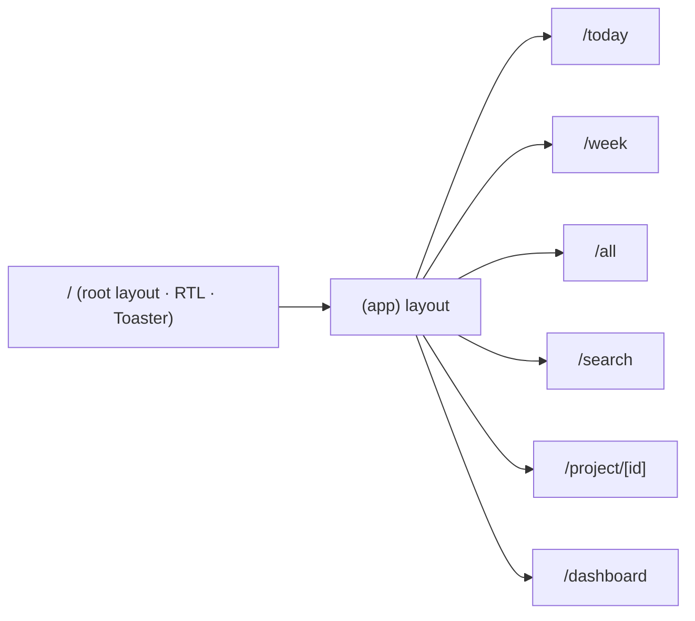

# דפים וניווט

מסלולים תחת `src/app/`. קבוצת `(app)` עוטפת את כל הדפים ב-Layout שמושך את עץ הפרויקטים ועוטף ב-[[רכיבים#ליבה (Layout)|AppShell]].

## המסלולים

> [!example] today
> `today/page.tsx` → מתוכנן / יעד / overdue. משתמש ב-`getTodayTasks()` ו-[[רכיבים#תצוגות (Client Views)|TaskViewClient]].

> [!example] week
> `week/page.tsx` → 7 ימים קדימה + overdue. `getWeekTasks()` + TaskViewClient.

> [!example] all
> `all/page.tsx` → כל המשימות עם FilterBar + SortMenu (state ב-URL params). ראה [[חיפוש וסינון]].

> [!example] search
> `search/page.tsx` → חיפוש live עם debounce ו-highlight. `searchTasks()` + SearchViewClient.

> [!example] project/[id]
> `project/[id]/page.tsx` → משימות של פרויקט בודד, עם [[רכיבים#ליבה (Layout)|ProjectHeader]].

> [!example] dashboard
> `dashboard/page.tsx` → סטטיסטיקות וגרפים. ראה [[Dashboard]].

## Layout שורש

`src/app/layout.tsx` — מגדיר `dir="rtl"` על `<html>`, טוען גופני Geist, ומרכיב את ה-`Toaster` (sonner).

> [!note] קיצורי מקלדת
> מנוהלים ב-AppShell. ראה [[Tech Stack ופקודות#קיצורי מקלדת]].

## ראה גם

- [[רכיבים]] · [[Server Actions]] · חזרה ל-[[בית]]
