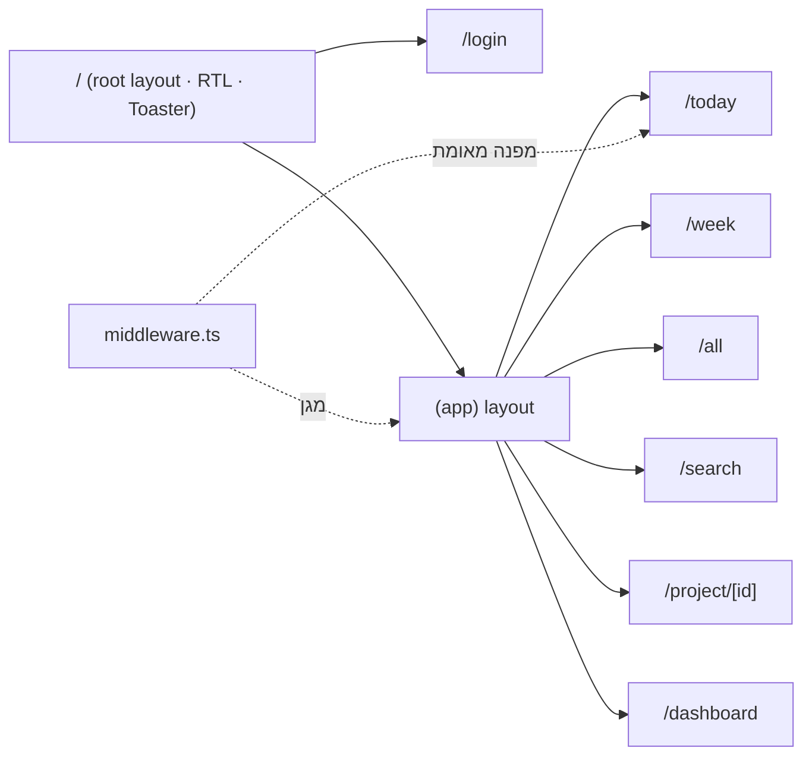

# דפים וניווט

מסלולים תחת `src/app/`. קבוצת `(app)` עוטפת את כל הדפים ב-Layout שמושך את עץ הפרויקטים ועוטף ב-[[רכיבים#ליבה (Layout)|AppShell]].

## Middleware — הגנת מסלולים

`src/middleware.ts` רץ ב-edge לפני כל בקשה:

- **לא-מאומת** שמנסה לגשת לכל מסלול מלבד `/login` ומסטטי → מופנה ל-`/login`.
- **מאומת** שניגש ל-`/login` → מופנה ל-`/today`.
- **`/api/whatsapp/*`** → מדולג (bypass) מאימות ה-cookie; ה-routes מאבטחים את עצמם. ראה [[וואטסאפ (Green API)]].

האימות מתבצע על ידי קריאה ל-`verifySessionToken` מ-`src/lib/auth.ts` על ה-cookie `tm_session`. ראה [[התחברות]] לפירוט מנגנון האימות.

## API Routes

> [!example] /api/whatsapp/digest
> route מאובטח (GET/POST) שנקרא ע"י cron חיצוני. מאמת `CRON_SECRET`, בונה דייג'סט יומי ושולח ב-Green API. ראה [[וואטסאפ (Green API)]].

> [!example] /api/whatsapp/webhook
> מקבל הודעות נכנסות מ-Green API (POST). בודק שהשולח הוא הבעלים, מנתב פקודה ומגיב. ראה [[וואטסאפ (Green API)]].

## המסלולים

> [!example] login
> `login/page.tsx` (Server Component) + `login/LoginForm.tsx` (Client Component). דף התחברות מחוץ לקבוצת `(app)`. ראה [[רכיבים#אימות|LoginForm]] ו-[[התחברות]].

> [!example] today
> `today/page.tsx` → מתוכנן / יעד / overdue. משתמש ב-`getTodayTasks()` ו-[[רכיבים#תצוגות (Client Views)|TaskViewClient]].

> [!example] week
> `week/page.tsx` → 7 ימים קדימה + overdue. `getWeekTasks()` + TaskViewClient.

> [!example] all
> `all/page.tsx` → כל המשימות עם FilterBar + SortMenu (state ב-URL params). ראה [[חיפוש וסינון]].

> [!example] search
> `search/page.tsx` → חיפוש live עם debounce ו-highlight. `searchTasks()` + SearchViewClient.

> [!example] project/[id]
> `project/[id]/page.tsx` → משימות של פרויקט בודד, עם [[רכיבים#ליבה (Layout)|ProjectHeader]].

> [!example] dashboard
> `dashboard/page.tsx` → סטטיסטיקות וגרפים. ראה [[Dashboard]].

## Layout שורש

`src/app/layout.tsx` — מגדיר `dir="rtl"` על `<html>`, טוען גופני Geist, ומרכיב את ה-`Toaster` (sonner).

> [!note] קיצורי מקלדת
> מנוהלים ב-AppShell. ראה [[Tech Stack ופקודות#קיצורי מקלדת]].

## ראה גם

- [[רכיבים]] · [[Server Actions]] · חזרה ל-[[בית]]
