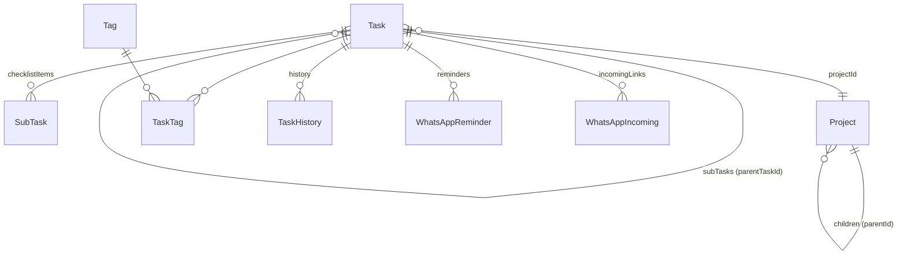

# מודל נתונים

סכמת Prisma 5 מעל **PostgreSQL** (Vercel Postgres / Neon). הקובץ: `prisma/schema.prisma`. ה-datasource משתמש ב-`POSTGRES_PRISMA_URL` (pooled) ו-`POSTGRES_URL_NON_POOLING` (`directUrl`, למיגרציות). ראה [[פריסה (Vercel)]].

> [!note] enum כ-String
> שדות ה-enum (`status`, `priority`) הם `String` ב-DB — לא Prisma enum — עם תבנית `as const` ב-`src/types/index.ts`. הדפוס נשמר גם אחרי המעבר מ-SQLite ל-PostgreSQL. ראה [[#סטטוס ועדיפות]].

> [!info] היסטוריה
> עד לפריסה ל-Vercel המערכת רצה על SQLite מקומי (`prisma/dev.db`). המעבר ל-PostgreSQL בוצע כי ה-filesystem של Vercel serverless אינו persistent. המיגרציות נוצרו מחדש עבור Postgres.

## תרשים יחסים (ER)

## טבלאות

> [!abstract] Task — לב המערכת
> `id, title, description?, status, priority, dueDate?, dueHasTime, plannedDate?, isRecurring, recurringRule?, projectId?, parentTaskId?, order, createdAt, updatedAt`
> - `parentTaskId` → תת-משימות (self-relation `SubTasks`)
> - `recurringRule` — JSON כ-String, ראה [[משימות חוזרות]]
> - `dueHasTime` — מבדיל בין "תאריך בלבד" ל"תאריך+שעה"
> - `plannedDate` — מתי **מתוכננת** לטיפול (נפרד מ-`dueDate` = יעד)

> [!abstract] Project — היררכי
> `id, name, color?, parentId?, createdAt`
> self-relation `SubProjects` → עץ פרויקטים אינסופי. ראה [[רכיבים#ProjectTree|ProjectTree]].

> [!abstract] Tag + TaskTag
> `Tag(id, name unique, color?)` · `TaskTag(taskId, tagId)` — junction many-to-many עם `onDelete: Cascade`.

> [!abstract] SubTask — פריטי צ'קליסט
> `id, taskId, title, completed, order` — רשימת תיוג בתוך משימה (שונה מתת-משימה שהיא Task נפרד).

> [!abstract] TaskHistory — ציר זמן שינויים
> `id, taskId, field, oldValue?, newValue?, changedAt` — נרשם בכל שינוי שדה, מוצג ב-[[רכיבים#TaskPanel|TaskPanel]].

> [!abstract]- WhatsApp (Phase 2 — לא ממומש)
> `WhatsAppReminder` ו-`WhatsAppIncoming` — הסכמה קיימת אך הפיצ'ר טרם מומש. ראה [[Phase 2 - WhatsApp]].

## סטטוס ועדיפות

מוגדרים ב-`src/types/index.ts` כתבנית `as const`:

| Status | תווית | | Priority | תווית |
|--------|-------|---|----------|-------|
| `DRAFT` | טיוטה | | `URGENT` | דחוף |
| `ACTIVE` | פעיל | | `HIGH` | גבוה |
| `COMPLETED` | הושלם | | `MEDIUM` | בינוני (ברירת מחדל) |
| `CANCELLED` | בוטל | | `LOW` | נמוך |

> [!tip] טיפוסים ל-UI
> `TaskWithRelations` הוא הטיפוס המלא עם כל היחסים (project, tags, checklistItems, history, subTasks) שעובר לרכיבים.

## מיגרציות

- `20260528182915_init` — סכמה ראשונית
- `20260529070849_add_task_order` — הוספת שדה `order` למיון ידני ([[רכיבים#SortableTaskList|drag-and-drop]])

## ראה גם

- [[Server Actions]] — הפעולות שניגשות לטבלאות אלה
- [[סקירת ארכיטקטורה]] · חזרה ל-[[בית]]
