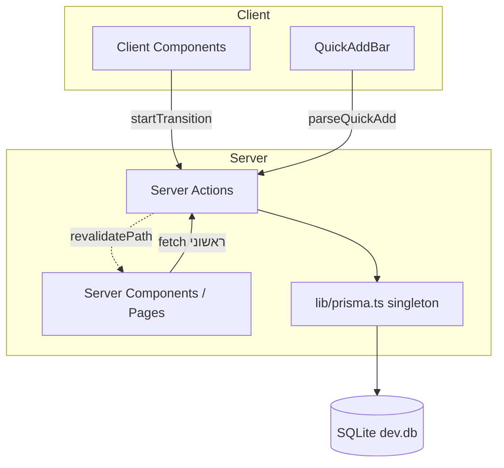

# סקירת ארכיטקטורה

המערכת בנויה כ-**Next.js 14 App Router** עם **Server Actions** כשכבת הגישה לנתונים — אין שכבת API נפרדת. רכיבי Client מייבאים פעולות שרת ישירות וקוראים להן בתוך `startTransition`.

> [!info] עקרון מרכזי
> אין REST/GraphQL endpoints. כל קריאה/כתיבה לנתונים עוברת דרך [[Server Actions]], שמורצות בשרת ומחזירות נתונים טיפוסיים (typed) ל-client.

## שכבות



## זרימת נתונים אופיינית

1. **טעינה ראשונית** — Server Component (דף) קורא ל-Server Action כמו `getTodayTasks()` ומעביר נתונים ל-Client Component.
2. **אינטראקציה** — המשתמש משנה משהו; Client Component קורא ל-action (למשל `updateTask`) בתוך `startTransition`.
3. **רענון** — ה-action מבצע `revalidatePath` לכל הדפים הרלוונטיים, וה-UI מתעדכן.

> [!warning] revalidatePath — דפוס חשוב
> משתמשים ב-`revalidatePath('/all')`, `revalidatePath('/today')`, `revalidatePath('/week')` בנפרד.
> **לא** משתמשים ב-`revalidatePath('/', 'layout')` — זה גורם ל-redirect מה-root.

## דפוסים מרכזיים

> [!example] שמירת `selectedTaskId` בלבד
> ב-UI שומרים רק את ה-ID של המשימה הנבחרת, ו-[[רכיבים#TaskPanel|TaskPanel]] מקבל נתונים טריים מה-server. כך אין סטייט כפול שמתיישן.
> ```ts
> const [selectedTaskId, setSelectedTaskId] = useState<string | null>(null)
> const selectedTask = allTasks.find(t => t.id === selectedTaskId) ?? null
> ```

> [!example] Enums כ-`as const`
> SQLite + Prisma 5 ללא תמיכת enum → שדות `String` ב-DB, עם תבנית `as const` ב-TypeScript. ראה [[מודל נתונים#סטטוס ועדיפות]].

## ראה גם

- [[מודל נתונים]] · [[Server Actions]] · [[רכיבים]] · [[דפים וניווט]]
- חזרה ל-[[בית]]
