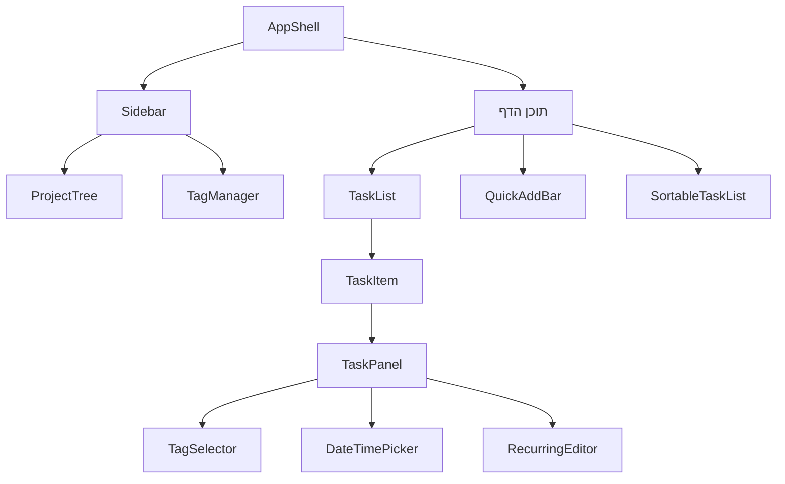

# רכיבים

רכיבי React ב-`src/components/`. רכיבי `ui/` הם shadcn/ui (Base UI) ולא מתועדים כאן בנפרד.

## היררכיית התצוגה

## ליבה (Layout)

| רכיב | תפקיד |
|------|-------|
| **AppShell** | עוטף Layout, קיצורי מקלדת, sidebar למובייל |
| **Sidebar** | ניווט + [[#ProjectTree]] + [[#TagManager]] |
| **ProjectTree** | עץ פרויקטים עם edit/delete ב-hover |
| **ProjectDialog** / **ProjectHeader** | יצירה/עריכה של פרויקט וכותרת עמוד |

## משימות

| רכיב | תפקיד |
|------|-------|
| **TaskList** / **TaskItem** | רשימת משימות ושורה בודדת |
| **TaskPanel** | side-sheet לעריכה מלאה (מקבל נתונים טריים מה-server) |
| **SortableTaskList** | drag-and-drop למיון ([[Server Actions#tasks.ts — משימות\|reorderTasks]]) |
| **QuickAddBar** | תיבת [[Quick Add]] עם preview של ה-NLP |
| **PriorityBadge** / **StatusBadge** | תגיות ויזואליות לעדיפות/סטטוס |

## עריכה ובחירה

| רכיב | תפקיד |
|------|-------|
| **TagSelector** | multi-select תגיות בפאנל |
| **TagManager** | ניהול תגיות (dialog) |
| **DateTimePicker** | calendar popover + toggle שעה |
| **RecurringEditor** | עורך כללי [[משימות חוזרות]] |

## תצוגות (Client Views)

| רכיב | משמש בדף |
|------|----------|
| **TaskViewClient** | [[דפים וניווט#today\|today]] / [[דפים וניווט#week\|week]] |
| **AllViewClient** | [[דפים וניווט#all\|all]] — FilterBar + SortMenu |
| **SearchViewClient** | [[דפים וניווט#search\|search]] — debounce + highlight |

> [!tip] TaskPanel — מקור אמת יחיד
> ה-UI שומר רק `selectedTaskId`; TaskPanel שולף את המשימה המעודכנת מרשימת המשימות הטרייה. ראה [[סקירת ארכיטקטורה#דפוסים מרכזיים]].

## ראה גם

- [[דפים וניווט]] · [[Server Actions]] · חזרה ל-[[בית]]
