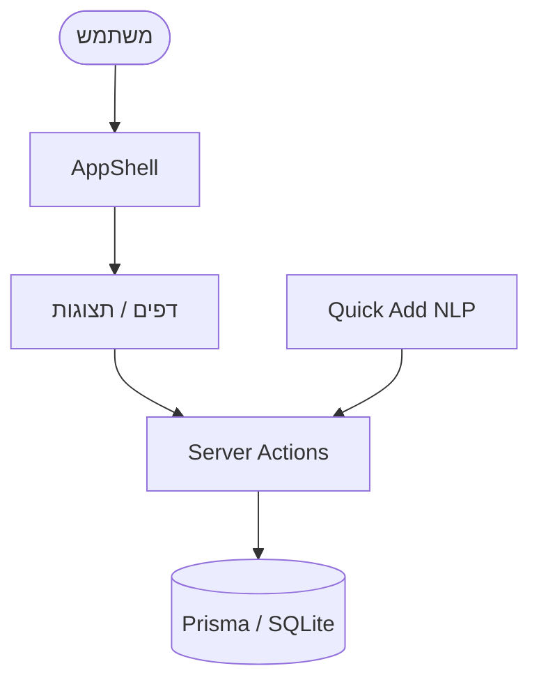

# 🏠 מערכת ניהול משימות אישית

מפת התוכן (MOC) לוואלט התיעוד של הפרויקט. אפליקציית **Next.js 14** לניהול משימות אישי בעברית (RTL), עם Quick Add בשפה טבעית, פרויקטים היררכיים, תגיות, משימות חוזרות ולוח מחוונים.

> [!abstract] במבט מהיר
> - **Framework:** Next.js 14 App Router · **DB:** SQLite + Prisma 5
> - **UI:** Tailwind + shadcn/ui · **שפה:** TypeScript strict · **RTL:** עברית
> - פירוט מלא: [[Tech Stack ופקודות]]

## 🗺️ ארכיטקטורה

- [[סקירת ארכיטקטורה]] — מבנה השכבות וזרימת הנתונים
- [[מודל נתונים]] — סכמת Prisma, טבלאות ויחסים
- [[Server Actions]] — כל פעולות השרת (CRUD ושאילתות)
- [[רכיבים]] — מפת רכיבי ה-React
- [[דפים וניווט]] — מסלולים (routes) ותצוגות

## ✨ תכונות

- [[Quick Add]] — מנתח שפה טבעית בעברית
- [[משימות חוזרות]] — חזרתיות יומית/שבועית/חודשית
- [[Dashboard]] — סטטיסטיקות וגרפים
- [[חיפוש וסינון]] — חיפוש live, פילטרים ומיון

## 📌 מטא ועתיד

- [[Tech Stack ופקודות]] — סטאק, פקודות בסיס, קיצורי מקלדת
- [[Phase 2 - WhatsApp]] — תזכורות WhatsApp (סכמה מוכנה, טרם מומש)

## מפת המערכת

> [!tip] איך לנווט בוואלט
> כל הקישורים הם `[[wikilinks]]` — לחיצה פותחת את ה-note. השתמש ב-Graph View של Obsidian כדי לראות את מפת הקשרים כולה.
