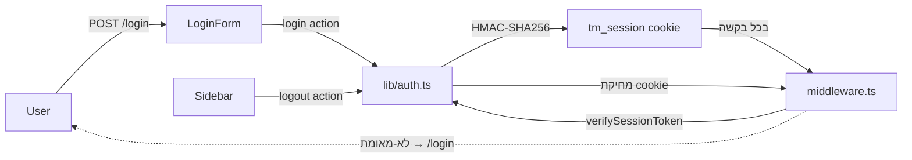

# התחברות — מנגנון אימות single-user

המערכת מגנה על כל המסלולים באמצעות אימות single-user פשוט המבוסס על cookie חתום. אין ניהול משתמשים — פרטי הגישה מוגדרים במשתני סביבה בלבד.

## ארכיטקטורה

## משתני סביבה

| משתנה | תפקיד |
|-------|-------|
| `APP_USERNAME` | שם המשתמש היחיד במערכת |
| `APP_PASSWORD` | סיסמה (נבדקת ב-`credentialsValid`) |
| `SESSION_SECRET` | מפתח סודי לחתימת ה-HMAC-SHA256 |

> [!warning] אבטחה
> לעולם אל תחשוף ערכי המשתנים בתיעוד, בלוגים, או בקוד מקומיט. ה-`.env` מוחרג מה-repository.

## `src/lib/auth.ts` — ספריית עזר

| פונקציה / קבוע | תפקיד |
|----------------|-------|
| `createSessionToken()` | יוצר JWT-like token חתום ב-HMAC-SHA256 (Web Crypto) |
| `verifySessionToken(token)` | מאמת חתימה ותוקף; מחזיר `true` / `false` |
| `credentialsValid(username, password)` | משווה מול `APP_USERNAME` / `APP_PASSWORD` |
| `SESSION_COOKIE = 'tm_session'` | שם ה-cookie |
| `SESSION_MAX_AGE` | אורך חיי ה-session |

> [!info] תאימות edge + node
> `lib/auth.ts` משתמש ב-**Web Crypto API** (`crypto.subtle`) — עובד גם ב-Next.js middleware (edge runtime) וגם ב-Server Actions (node runtime).

## `src/lib/actions/auth.ts` — Server Actions

ראה [[Server Actions#auth.ts — אימות משתמש]].

## זרימת התחברות

1. המשתמש מגיש טופס `/login` → `login(prevState, formData)` רץ בשרת.
2. `credentialsValid` בודק אישורים מול ה-.env.
3. בהצלחה: `createSessionToken` יוצר token, מוגדר cookie `tm_session` (httpOnly, `Secure` בפרודקשן), ומתבצע redirect ל-`/today`.
4. בכשלון: מוחזרת הודעת שגיאה ל-`useFormState` ב-`LoginForm`.

## זרימת התנתקות

כפתור "התנתקות" ב-[[רכיבים#ליבה (Layout)|Sidebar]] שולח form עם `action={logout}`. ה-action מוחק את ה-cookie ומפנה ל-`/login`.

## Middleware

`src/middleware.ts` מגן על כל המסלולים חוץ מ-`/login` ומסטטי. ראה [[דפים וניווט#Middleware — הגנת מסלולים]].

## ראה גם

- [[Server Actions#auth.ts — אימות משתמש]] · [[רכיבים#אימות]] · [[דפים וניווט#Middleware — הגנת מסלולים]]
- חזרה ל-[[בית]]
