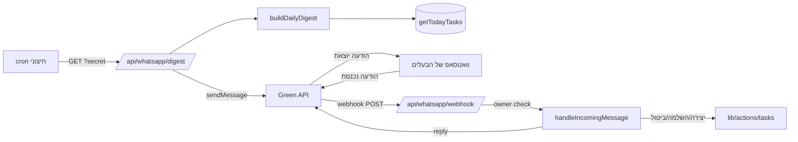

# וואטסאפ — אינטגרציית Green API

אינטגרציה דו-כיוונית עם WhatsApp דרך [Green API](https://green-api.com), single-user:

- **יוצא — דייג'סט יומי:** פעם ביום נשלחת למספר הבעלים הודעה עם משימות היום (מתוכננות, יעד היום, ובאיחור).
- **נכנס — פקודות בשפה חופשית:** הבעלים שולח הודעת וואטסאפ; המערכת מזהה כוונה (רשימה / השלמה / ביטול / יצירת משימה) ומגיבה.

## ארכיטקטורה

## משתני סביבה

| משתנה | תפקיד |
|-------|-------|
| `GREEN_API_INSTANCE` | `idInstance` מקונסולת Green API |
| `GREEN_API_TOKEN` | `apiTokenInstance` מהקונסולה |
| `GREEN_API_BASE_URL` | ברירת מחדל `https://api.green-api.com` |
| `MY_WHATSAPP_CHAT_ID` | chat id של הבעלים, פורמט `972XXXXXXXXX@c.us` |
| `CRON_SECRET` | סוד המגן על route הדייג'סט |
| `WHATSAPP_WEBHOOK_TOKEN` | אופציונלי — סוד ב-URL של ה-webhook (`?token=`) |

> [!warning] אבטחה
> ה-`.env` מוחרג מה-repository. אין לחשוף ערכי משתנים בתיעוד/לוגים/קומיט.

## קבצים

| קובץ | תפקיד |
|------|-------|
| `src/lib/whatsapp/client.ts` | לקוח Green API — `sendWhatsAppMessage`, `greenApiConfig`, `isGreenApiConfigured` |
| `src/lib/whatsapp/digest.ts` | `buildDailyDigest()` — בונה טקסט המשימות של היום |
| `src/lib/whatsapp/commands.ts` | `handleIncomingMessage(text)` — ניתוב כוונה + ביצוע |
| `src/app/api/whatsapp/digest/route.ts` | route מאובטח (GET/POST) לשליחת הדייג'סט |
| `src/app/api/whatsapp/webhook/route.ts` | route ל-webhook נכנס מ-Green API |

## פקודות נכנסות (עברית)

| כוונה | טריגר | פעולה |
|-------|-------|-------|
| רשימת היום | `משימות`, `היום`, `רשימה`, `מה יש לי` | מחזיר את הדייג'סט |
| השלמת משימה | `סגור`/`בוצע`/`סיימתי`/`השלם` + שם | `completeTask` על התאמה יחידה |
| ביטול משימה | `בטל`/`ביטול` + שם | `updateTask(status: CANCELLED)` |
| עזרה | `עזרה`, `?`, `פקודות` | טקסט עזרה |
| יצירת משימה | כל טקסט אחר | `parseQuickAdd` → `createTask` (ראה [[Quick Add]]) |

התאמת משימה נעשית לפי `title contains` על משימות פעילות (ACTIVE/DRAFT). אם נמצאו כמה — המערכת מחזירה רשימה ומבקשת לפרט.

## Middleware

`src/middleware.ts` מדלג על אימות ה-cookie עבור `/api/whatsapp/*` — ה-routes מאבטחים את עצמם (`CRON_SECRET`, token, ובדיקת בעלים). ראה [[דפים וניווט#Middleware — הגנת מסלולים]].

## הגדרה (setup)

1. **קונסולה:** פותחים instance ב-[console.green-api.com](https://console.green-api.com), מעתיקים `idInstance` + `apiTokenInstance`, וסורקים QR לחיבור הוואטסאפ.
2. **`.env`:** ממלאים `GREEN_API_INSTANCE`, `GREEN_API_TOKEN`, `MY_WHATSAPP_CHAT_ID`; מפעילים מחדש את השרת.
3. **Webhook:** האפליקציה רצה מקומית → חושפים אותה עם tunnel (למשל ngrok) ומגדירים בקונסולה את `webhookUrl` ל-`https://<tunnel>/api/whatsapp/webhook`, ומפעילים "Incoming webhooks".
4. **Cron יומי:** מזמנים (cron/launchd) בקשה יומית ל-`/api/whatsapp/digest?secret=<CRON_SECRET>`.

## מודל נתונים

שתי הטבלאות `WhatsAppIncoming` ו-`WhatsAppReminder` קיימות ב-schema. ה-webhook כותב כל הודעה נכנסת ל-`WhatsAppIncoming` (עם `processedAt`). ראה [[מודל נתונים]].

## ראה גם

- [[Quick Add]] · [[דפים וניווט#Middleware — הגנת מסלולים]] · [[מודל נתונים]]
- חזרה ל-[[בית]]
