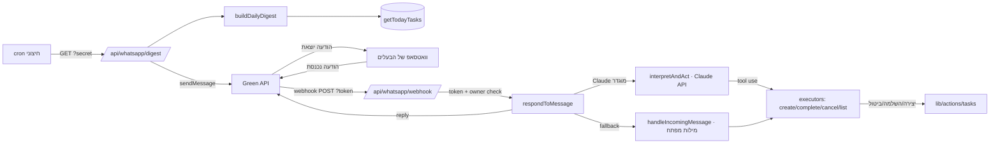
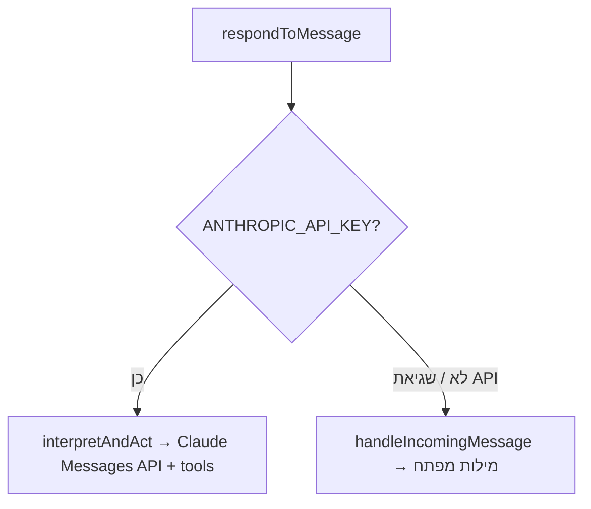

# וואטסאפ — אינטגרציית Green API

אינטגרציה דו-כיוונית עם WhatsApp דרך [Green API](https://green-api.com), single-user:

- **יוצא — דייג'סט יומי:** פעם ביום נשלחת למספר הבעלים הודעה עם משימות היום (מתוכננות, יעד היום, ובאיחור).
- **נכנס — שיחה בשפה חופשית עם Claude:** הבעלים שולח הודעת וואטסאפ; **Claude API** מבין את הבקשה (בשפה חופשית) ומפעיל כלים (רשימה / יצירה / השלמה / ביטול). אם `ANTHROPIC_API_KEY` חסר — המערכת נופלת לפרסר מבוסס-מילות-מפתח בעברית.

## ארכיטקטורה

## שתי דרכי הבנה

- **מסלול Claude (`ai.ts`):** קריאה יחידה ל-Anthropic Messages API עם 4 כלים — `list_today`, `create_task`, `complete_task`, `cancel_task`. ה-system prompt כולל את תאריך היום כדי לפענח תאריכים יחסיים ("מחר", "יום ראשון הבא"). בלוקי `tool_use` שהמודל מחזיר מבוצעים דרך ה-executors ב-`commands.ts`; אם המודל החזיר טקסט בלבד — הוא נשלח כתשובה.
- **Fallback (`commands.ts`):** אם המפתח חסר או שקריאת ה-API נכשלה — ניתוב מבוסס מילות-מפתח (אותם executors).

## משתני סביבה

| משתנה | תפקיד |
|-------|-------|
| `GREEN_API_INSTANCE` | `idInstance` מקונסולת Green API |
| `GREEN_API_TOKEN` | `apiTokenInstance` מהקונסולה |
| `GREEN_API_BASE_URL` | ברירת מחדל `https://api.green-api.com` |
| `MY_WHATSAPP_CHAT_ID` | chat id של הבעלים, פורמט `972XXXXXXXXX@c.us` |
| `CRON_SECRET` | סוד המגן על route הדייג'סט |
| `WHATSAPP_WEBHOOK_TOKEN` | **חובה** — סוד ב-URL של ה-webhook (`?token=`). בלעדיו ה-webhook מחזיר 503 |
| `ANTHROPIC_API_KEY` | מפעיל את מסלול Claude לשיחה חופשית. חסר → fallback למילות מפתח |
| `ANTHROPIC_MODEL` | אופציונלי — override למודל (ברירת מחדל `claude-haiku-4-5-20251001`) |

> [!warning] אבטחה
> ה-`.env` מוחרג מה-repository. אין לחשוף ערכי משתנים בתיעוד/לוגים/קומיט.

> [!important] אבטחת ה-webhook — שתי שכבות
> 1. **טוקן סודי (`?token=`)** — נבדק מול `WHATSAPP_WEBHOOK_TOKEN`. אם המשתנה לא מוגדר, ה-route דוחה הכול (503) כדי למנוע webhook לא-מאומת בפריסה שגויה.
> 2. **אימות שולח** — רק `chatId` השווה ל-`MY_WHATSAPP_CHAT_ID` מטופל; הודעה עם טוקן תקין ממספר אחר מסוננת (`not_owner`).

> [!note] סוגי webhook שמטופלים (single-number vs dedicated)
> ה-route מטפל בשני סוגי notification (`HANDLED_TYPES`):
> - `incomingMessageReceived` — הודעה שנשלחה **אל** ה-instance (setup עם מספר ייעודי: הבעלים כותב לבוט ממכשיר אחר).
> - `outgoingMessageReceived` — הודעה שהבעלים הקליד **במכשיר עצמו** בצ'אט "הודעה לעצמי" (setup עם מספר יחיד — ה-instance **הוא** מספר הבעלים).
>
> `outgoingAPIMessageReceived` (התשובות שהבוט שולח דרך ה-API) **מסונן במפורש** כדי למנוע לולאת תגובות. בשני המקרים `senderData.chatId` נבדק מול `MY_WHATSAPP_CHAT_ID`.
> **בקונסולת Green API** יש להפעיל גם את התראות ההודעות היוצאות (`outgoingWebhook`) כדי ש-setup עם מספר יחיד יעבוד.

## קבצים

| קובץ | תפקיד |
|------|-------|
| `src/lib/whatsapp/client.ts` | לקוח Green API — `sendWhatsAppMessage`, `greenApiConfig`, `isGreenApiConfigured` |
| `src/lib/whatsapp/digest.ts` | `buildDailyDigest()` — בונה טקסט המשימות של היום |
| `src/lib/whatsapp/respond.ts` | `respondToMessage(text)` — dispatcher: Claude אם מוגדר, אחרת מילות מפתח |
| `src/lib/whatsapp/ai.ts` | `interpretAndAct(text)` + `isAiConfigured()` — מסלול Claude API עם tool use |
| `src/lib/whatsapp/commands.ts` | executors (`listTodayText`, `createTaskStructured`, `completeByQuery`, `cancelByQuery`) + `handleIncomingMessage` (fallback מילות מפתח) |
| `src/app/api/whatsapp/digest/route.ts` | route מאובטח (GET/POST) לשליחת הדייג'סט |
| `src/app/api/whatsapp/webhook/route.ts` | route ל-webhook נכנס — טוקן חובה + אימות שולח → `respondToMessage` |

## פקודות נכנסות

במסלול Claude אין צורך במילות מפתח — כותבים בשפה חופשית ("תזכיר לי להתקשר לרופא מחר ב-9", "סיימתי עם הדוח", "מה יש לי היום?") והמודל בוחר את הכלי המתאים. הכלים:

| כלי (Claude) | פעולה (executor) |
|--------------|------------------|
| `list_today` | `listTodayText()` → הדייג'סט |
| `create_task` | `createTaskStructured()` (title, due_date ISO, has_time, priority, project, tags) |
| `complete_task` | `completeByQuery(query)` → `completeTask` על התאמה יחידה |
| `cancel_task` | `cancelByQuery(query)` → `updateTask(status: CANCELLED)` |

**Fallback (מילות מפתח)** — כאשר `ANTHROPIC_API_KEY` חסר:

| כוונה | טריגר | פעולה |
|-------|-------|-------|
| רשימת היום | `משימות`, `היום`, `רשימה`, `מה יש לי` | הדייג'סט |
| השלמת משימה | `סגור`/`בוצע`/`סיימתי`/`השלם` + שם | `completeByQuery` |
| ביטול משימה | `בטל`/`ביטול` + שם | `cancelByQuery` |
| עזרה | `עזרה`, `?`, `פקודות` | טקסט עזרה |
| יצירת משימה | כל טקסט אחר | `parseQuickAdd` → `createTaskStructured` (ראה [[Quick Add]]) |

התאמת משימה (בשני המסלולים) נעשית לפי `title contains` על משימות פעילות (ACTIVE/DRAFT). אם נמצאו כמה — המערכת מחזירה רשימה ומבקשת לפרט.

## Middleware

`src/middleware.ts` מדלג על אימות ה-cookie עבור `/api/whatsapp/*` — ה-routes מאבטחים את עצמם (`CRON_SECRET` לדייג'סט, טוקן חובה + בדיקת בעלים ל-webhook). ראה [[דפים וניווט#Middleware — הגנת מסלולים]].

## הגדרה (setup)

1. **קונסולה:** פותחים instance ב-[console.green-api.com](https://console.green-api.com), מעתיקים `idInstance` + `apiTokenInstance`, וסורקים QR לחיבור הוואטסאפ.
2. **`.env`:** ממלאים `GREEN_API_INSTANCE`, `GREEN_API_TOKEN`, `MY_WHATSAPP_CHAT_ID`, `WHATSAPP_WEBHOOK_TOKEN` (חובה), ו-`ANTHROPIC_API_KEY` (לשיחה חופשית); מפעילים מחדש את השרת.
3. **Webhook:** האפליקציה רצה מקומית → חושפים אותה עם tunnel (למשל ngrok) ומגדירים בקונסולה את `webhookUrl` ל-`https://<tunnel>/api/whatsapp/webhook?token=<WHATSAPP_WEBHOOK_TOKEN>`, ומפעילים "Incoming webhooks".
4. **Cron יומי:** מזמנים (cron/launchd) בקשה יומית ל-`/api/whatsapp/digest?secret=<CRON_SECRET>`.

## מודל נתונים

שתי הטבלאות `WhatsAppIncoming` ו-`WhatsAppReminder` קיימות ב-schema. ה-webhook כותב כל הודעה נכנסת ל-`WhatsAppIncoming` (עם `processedAt`). ראה [[מודל נתונים]].

## ראה גם

- [[Quick Add]] · [[דפים וניווט#Middleware — הגנת מסלולים]] · [[מודל נתונים]]
- חזרה ל-[[בית]]
